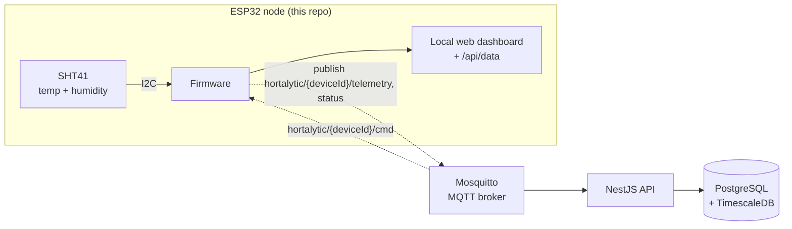

# Hortalytic Node

Firmware for the sensor devices in **Hortalytic**, a system for monitoring and, later, automating greenhouses.

A node is an ESP32 with sensors placed in a greenhouse. It measures the climate and, as the system matures, sends its readings over MQTT to the [Hortalytic API](https://github.com/Guruen/hortalytic-api), a NestJS backend that stores them in TimescaleDB. The long term goal is to supply devices to other greenhouse owners, collect their data and present it in an app or website.

The project is currently a proof of concept running with a single device in my own greenhouse.

## Architecture



Dashed lines are planned and not yet built in the firmware. The broker, backend and database live in [hortalytic-api](https://github.com/Guruen/hortalytic-api).

## What the firmware does today

- Reads temperature and relative humidity from a Sensirion SHT41 over I2C every 5 seconds, in high precision mode
- Calculates the dew point with the Magnus formula
- Serves a small web dashboard on `http://drivhus.local/` and the current values as JSON on `/api/data`
- Announces itself on the LAN with mDNS
- Accepts password protected firmware updates over Wi-Fi (ArduinoOTA)
- Reconnects to Wi-Fi and retries the sensor on its own if either drops out

Example response from `/api/data`:

```json
{"temp":21.43,"fugt":64.10,"dug":14.37,"sensor_inde":true,"rssi":-61,"uptime":8423411}
```

## Hardware

| Part | Details |
|---|---|
| Board | ESP32 DevKit (`esp32dev`) |
| Sensor | Sensirion SHT41, I2C address `0x44` |
| Wiring | SDA → GPIO 21, SCL → GPIO 22, 3.3 V, GND |

## Tech stack

- C++ on the Arduino framework for ESP32
- PlatformIO for builds, dependency pinning and uploads
- Adafruit SHT4x library
- ArduinoOTA, ESPmDNS and WebServer from the ESP32 core

## Design decisions

**PlatformIO instead of the Arduino IDE.** The project started in the Arduino IDE. PlatformIO gives a declarative build in `platformio.ini`, pinned library versions, and separate environments for USB and OTA uploads, so the build is reproducible and can run from the command line or CI.

**Non-blocking main loop.** Sensor reads, Wi-Fi checks and sensor retries are scheduled with `millis()` instead of `delay()`. The web server and OTA handler keep responding while the device waits for the next measurement.

**Degrade instead of fail.** If Wi-Fi is not available at boot, the device keeps measuring locally and connects when the network returns. If the sensor stops responding, values are reported as `null` rather than stale numbers, and the sensor is re-initialised every 30 seconds.

**Secrets outside the repository.** Wi-Fi credentials and the OTA password live in `include/secrets.h`, which is git ignored, with `secrets.example.h` as a template. The OTA upload reads its password from the `OTA_PASS` environment variable, so it never appears in `platformio.ini`.

**MQTT, one identity per device (planned).** When MQTT is added, each device connects with its own username (its `deviceId`) and password, and the broker ACL only lets it write to its own `telemetry` and `status` topics and read its own `cmd` topic. Payloads are versioned JSON with the device's own timestamp. Broker URL, port and CA certificate will be configurable, so devices can move from plain MQTT on the LAN to TLS on port 8883 without code changes. The reasoning behind MQTT over HTTP and the backend side of these contracts is described in [hortalytic-api](https://github.com/Guruen/hortalytic-api#design-decisions).

## Getting started

Requirements: [PlatformIO](https://platformio.org/) (CLI or the VS Code extension) and an ESP32 board with an SHT41 wired as above.

```bash
# 1. Create the secrets file and fill in Wi-Fi SSID, Wi-Fi password and an OTA password
cp include/secrets.example.h include/secrets.h

# 2. Build and flash over USB
pio run -e usb -t upload

# 3. Watch the serial output (115200 baud)
pio device monitor
```

Once the device is on the network, open `http://drivhus.local/`.

### Updates over Wi-Fi

After the first USB flash, later updates can go over the network. Set `OTA_PASS` to the same value as in `secrets.h`:

```bash
# bash
OTA_PASS=<password> pio run -e ota -t upload
```

```powershell
# PowerShell
$env:OTA_PASS = "<password>"; pio run -e ota -t upload
```

## Status

The firmware runs on one device in my own greenhouse and serves readings on the local network. It does not yet send data to the backend.

## Roadmap

1. Time sync with NTP so readings carry a real timestamp
2. MQTT client with per-device credentials, publishing versioned telemetry and status
3. Configurable broker URL, port and CA certificate for TLS on port 8883
4. Buffering of readings while the broker is unreachable
5. More sensors, such as light and soil moisture
6. Receiving commands on the `cmd` topic to drive actuators for automation
7. Provisioning flow so devices can be handed to other greenhouse owners

## Related repository

- [hortalytic-api](https://github.com/Guruen/hortalytic-api): NestJS backend, MQTT broker and TimescaleDB setup

## About the developer

Brian Brandt, developer with a focus on backend. I work mainly with NestJS, TypeScript and microservices.

- GitHub: [Guruen](https://github.com/Guruen)
- LinkedIn: [LINKEDIN_URL]

## License

Copyright (c) 2026 Brian Brandt. All rights reserved.

This is proprietary software. The source code is public for viewing only, as reference and portfolio. It may not be used, copied, modified or distributed without prior written permission. See [LICENSE](LICENSE).

Third party libraries are covered by their own licenses.
